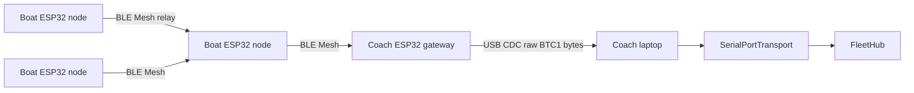

# boatconnect

TypeScript library for **binary-framed** dragon boat telemetry: encode/decode, stream parsing, UDP datagram mode, TCP client/server transports, and a small **fleet multiplexer** (`FleetHub`).

Wire format is defined in [PROTOCOL.md](./PROTOCOL.md). Metrics semantics align with [speedcoach](https://github.com/ATOMY-LAB/speedcoach) (SPM, DPS, speed); payloads carry scaled integers.

**Repository:** [github.com/ATOMY-LAB/boatconnect](https://github.com/ATOMY-LAB/boatconnect)

[](https://github.com/ATOMY-LAB/boatconnect/actions/workflows/ci.yml)

## Requirements

- Node **20+** to **consume** the built package (`dist/` is plain JS).
- Node **22.6+** to run **`npm test`** / **`npm run verify`** (TypeScript test files via `node --experimental-strip-types`), or **Bun** for examples.
- TypeScript **5.7+** to build `dist/` (`npm run build`).

## Install / build

```bash
git clone https://github.com/ATOMY-LAB/boatconnect.git
cd boatconnect
npm install
npm run build
npm test
```

CI runs the same checks on Node 20 and 22 (see `.github/workflows/ci.yml`).

## Quick usage

```ts
import {
  FleetHub,
  TcpClientTransport,
  encodeTelemetrySummaryFrame,
  decodeFrame,
} from "boatconnect";

const hub = new FleetHub();
hub.subscribe(({ boatId, frame }) => {
  console.log(boatId, frame.msgType);
});

const tcp = new TcpClientTransport({ host: "192.168.4.1", port: 9000, hub });
await tcp.connect();
await tcp.send(
  encodeTelemetrySummaryFrame(
    { boatId: 1, seq: 1 },
    {
      timestampMs: BigInt(Date.now()),
      latE7: 0,
      lonE7: 0,
      speedMmS: 3000,
      spmX100: 7200,
      dpsX100: 250,
      telemetryFlags: 0,
    },
  ),
);
```

UDP: run `bun examples/udp-listen.ts` and send one **complete frame per datagram** (e.g. from firmware).

## Metrics & fleet health

- **DPS** — `dpsFromSpeedMpsAndSpm`, `dpsX100FromSpeedMmSAndSpmX100` match speedcoach-style DPS = speed / (SPM/60).
- **Scaling** — `latLonToE7`, `speedMpsToMmS`, `spmToX100` convert floats to on-wire integers.
- **Stroke rate (analysis)** — `StrokeRateEstimator` is a simple scalar peak detector for replay or bench processing (not a firmware port).
- **FleetHub** — `getLastSeenMs`, `isStale`, `snapshotLastSeenMs`, `clearBoat`, `resetAll` for connection freshness per `boatId`.

## Scripts

| Script | Description |
|--------|-------------|
| `npm run build` | Emit `dist/` |
| `npm test` / `npm run verify` | Build, then run all `test/*.test.ts` |
| `bun examples/encode-sample.ts` | Print sample frames |
| `bun examples/udp-listen.ts` | Listen UDP (default port 9100) |
| `bun examples/udp-send.ts` | Send sample UDP frames (`HOST` / `PORT` env) |
| `bun examples/tcp-server.ts` | TCP server: decode inbound streams (port `9000`) |
| `bun examples/ws-bun-server.ts` | Bun WebSocket ingest (default port 9200) |
| `bun examples/serial-listen.ts` | Serial / USB-CDC ingest from a BLE Mesh gateway (`PORT` env) |

## Firmware

See [`firmware/`](firmware/) for packed C structs and a reference `bc_crc32` implementation matching the wire CRC, plus two ESP-IDF reference projects: a BLE Mesh boat node and a coach gateway.

## BLE Mesh transport

Boats can ship `BTC1` frames over Bluetooth Mesh (multi-hop relay between ESP32 nodes) when Wi-Fi is not available on the water. The wire format is unchanged — a `BTC1` frame is the access-layer payload of one vendor-model opcode. The coach gateway forwards received bytes verbatim to USB CDC, and `SerialPortTransport` feeds them into `FleetHub` exactly like a TCP socket.



Reference firmware: [`firmware/esp_ble_mesh_node/`](firmware/esp_ble_mesh_node/), [`firmware/esp_ble_mesh_gateway/`](firmware/esp_ble_mesh_gateway/), build instructions in [`firmware/README.md`](firmware/README.md). Wire-level details for BLE Mesh carriage (CID, model ids, opcodes, size guidance) are in [PROTOCOL.md](./PROTOCOL.md).

`SerialPortTransport` requires the optional `serialport` dependency (installed automatically via `npm install`). For a star-only fallback without mesh — e.g., short-range regattas where every boat is in single-hop range — [olegv142/esp32-ble-uart-mx](https://github.com/olegv142/esp32-ble-uart-mx) is a useful BLE-NUS bridge that can carry the same `BTC1` byte stream.

```ts
import { FleetHub, SerialPortTransport } from "boatconnect";

const hub = new FleetHub();
hub.subscribe(({ boatId, frame }) => console.log(boatId, frame.msgType, frame.seq));

const serial = new SerialPortTransport({ hub, path: "/dev/ttyACM0", baudRate: 115200 });
await serial.start();
```

## Multi-connection note

`FleetHub.feedStream()` uses **one** internal parser — use it with a **single** TCP/WebSocket byte stream (e.g. `TcpClientTransport`). For **multiple** simultaneous TCP or WebSocket clients, give each connection its own `FrameParser` and forward with `hub.ingestDecoded(frame)` (as in `TcpServerTransport` and `examples/ws-bun-server.ts`).

## License

MIT
